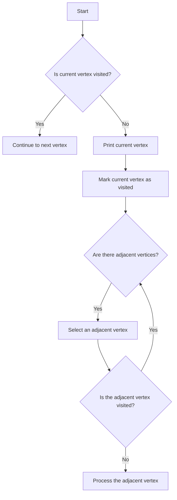
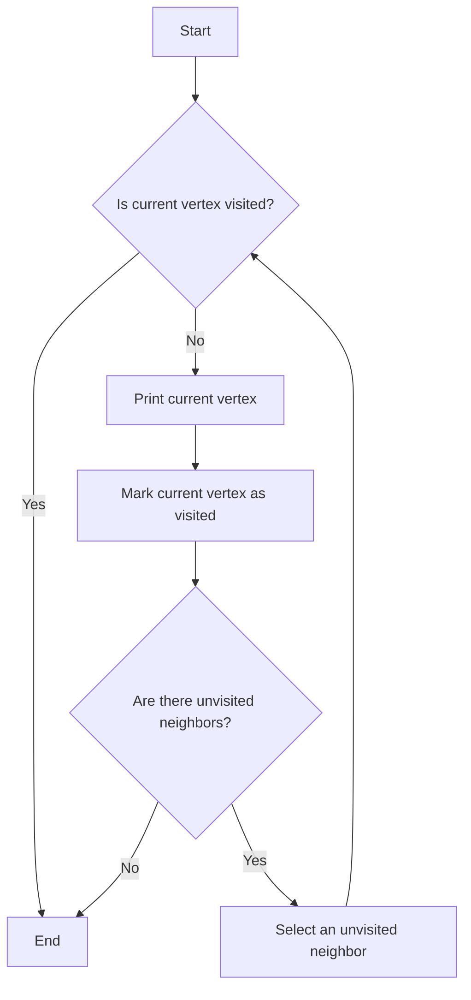

# Graph Traversal Algorithms

## Introduction

This module contains implementations of two graph traversal algorithms: dfsList and dfsMatrix. These algorithms can be used to explore graphs in a systematic manner.

## dfsList Algorithm

The dfsList algorithm follows the depth-first search (DFS) approach using an adjacency list representation of the graph.

### Algorithm Logic

The algorithm logic can be visualized using the following Mermaid diagram:

## dfsMatrix Algorithm

The dfsMatrix algorithm also follows the depth-first search (DFS) approach but uses an adjacency matrix representation of the graph.

### Algorithm Logic

The algorithm logic can be visualized using the following Mermaid diagram:

